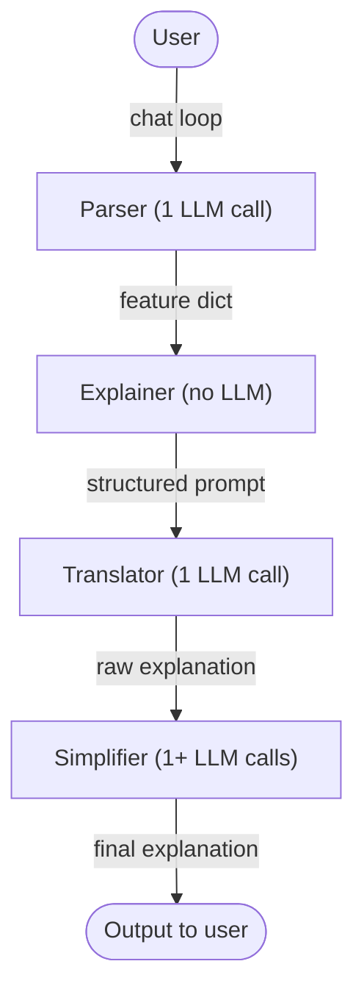

# MAINLE - Source Overview

## Pipeline



The `ChatEngine` (e.g. `Llama`, `Gpt`, `DeepSeek`) is injected into each LLM step and is swapped in `examples/mydataset.py`.

---

## Adding a new dataset/Model

You need to create or modify **4 files**. Everything else is inherited.

### 1. `parsers/mydataset.py`

Two things live here:

- **`YourParser(LlmParser)`** implements `_welcome_message()` and `_response_to_dict()`.
  `_response_to_dict` must return a dict with the exact feature names expected by the dataset,
  or `None` if the LLM reply is not yet parseable (the loop will keep asking).

- **`your_system_instructions()`** the system prompt that tells the LLM which features to collect
  and which class values are valid. Feature names here must match the column names of your dataframe exactly.

### 2. `explainers/mydataset.py`

- **`YourExplainer(LoreExplainer)`** loads your data and wraps your model.
- The default examples train a new sklearn model from scratch inside `_train_model`.
  You can alternatively load a pre-trained sklearn model and wrap it directly:
  ```python
  import joblib
  from lore_sa.bbox import sklearn_classifier_bbox

  class YourExplainer(LoreExplainer):
      def __init__(self):
          self.dataset = TabularDataset(your_df, class_name="class")
          clf = joblib.load("path/to/your_model.pkl")
          self.model = sklearn_classifier_bbox.sklearnBBox(clf)
          super().__init__(self.dataset, self.model)
  ```
  `sklearnBBox` requires the model to expose both `predict` and `predict_proba`.

### 3. `examples/mydataset.py`

Wires together parser + explainer + translator + simplifier.
This is the only file that changes if you swap the LLM engine.
Copy `examples/iris.py` and replace the imports.

### 4. `main.py`

Just swap the import:
```python
from mainle.examples.mydataset import main
```

---

## Notes on the current design

- The `Parser` currently asks the user for the **class** as well as the measurements.
  This is by design: MAINLE was conceived for the case where the user already has a prediction
  from an external system and wants an explanation for it.
  The assertion in `explainer.py` is a sanity check that MAINLE's internal model agrees.
  Could be relaxed in the future if we want to support the case where the user only has measurements and no prediction, but it would require changing the pipeline: having the black-box model predict the class before the `Parser` step, and passing it downstream for the `Explainer` to verify, meanwhile it is provided back to the user already, with the "wait, I will explain this prediction" message.

- The `Simplifier` is the only step with a real interactive loop,  it handles follow-up questions  and exits when the user types "thanks", "thank you", or "goodbye".

- History is saved as JSON after each step (`1_parser.json`, `2_translator.json`, …)
  and merged into `../history/full_history.json` at the end.
